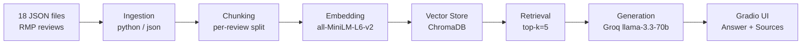

# Project 1 Planning: The Unofficial Guide

> Write this document before you write any pipeline code.
> Your spec and architecture diagram are what you'll use to direct AI tools (Claude, Copilot, etc.) to generate your implementation — the more specific they are, the more useful the generated code will be.
> Update the Retrieval Approach and Chunking Strategy sections if you change your approach during implementation.
> Update this file before starting any stretch features.

---

## Domain

Domain is student reviews of CS and Maths professors at Berea College. This knowledge is valuable but hard to find because Rate my professor pages are professor-by-professor with no way to search across them.

---

## Documents

<!-- List your specific sources: URLs, subreddit names, forum threads, or file descriptions.
     Aim for at least 10 sources that together cover different subtopics or perspectives within your domain. -->

| # | Source | Description | URL or location |
|---|--------|-------------|-----------------|
| 1 | Rate My Professors — Jan Pearce | 45 reviews of CS professor; highly polarized, heavy workload, writing-intensive classes | data/raw/Jan_Pearce.json |
| 2 | Rate My Professors — Larry Gratton | 26 reviews of Math professor; generally supportive, accused of moving too slowly | data/raw/Larry_Gratton.json |
| 3 | Rate My Professors — Mario Nakazawa | 19 reviews of CS professor; mixed, seen as funny but unclear instructions | data/raw/Mario_Nakazawa.json |
| 4 | Rate My Professors — Kristen Barnard | 17 reviews of Math professor; very low rating, strong criticism of teaching style | data/raw/Kristen_Barnard.json |
| 5 | Rate My Professors — Elizabeth Kelly | 13 reviews of Math professor; low rating, unclear expectations and harsh grading | data/raw/Elizabeth_Kelly.json |
| 6 | Rate My Professors — James Blackburn-Lynch | 12 reviews of Math professor; mixed, chill personality but fast-paced lectures | data/raw/James_Blackburn-Lynch.json |
| 7 | Rate My Professors — Lisa Jones | 12 reviews of Math professor; very low rating, accused of belittling students | data/raw/Lisa_Jones.json |
| 8 | Rate My Professors — J.P. Lee | 12 reviews of Math professor; mixed, patient but hard to follow lectures | data/raw/J.P._Lee.json |
| 9 | Rate My Professors — Clinton Hines | 11 reviews of Math professor; mixed, fun personality but inconsistent explanations | data/raw/Clinton_Hines.json |
| 10 | Rate My Professors — Judy Rector | 11 reviews of Math professor; mixed, helpful but disorganized grading | data/raw/Judy_Rector.json |
| 11 | Rate My Professors — Sara Ellis | 11 reviews of Math professor; near-perfect rating, very caring and accessible | data/raw/Sara_Ellis.json |
| 12 | Rate My Professors — Scott Heggen | 11 reviews of CS professor; mostly positive, clear assignments, accessible | data/raw/Scott_Heggen.json |
| 13 | Rate My Professors — Richard Maiti | 10 reviews of CS professor; highly rated, caring and knowledgeable mentor | data/raw/Richard_Maiti.json |
| 14 | Rate My Professors — Terri Thesing | 7 reviews of Math professor; near-perfect rating, pushes students to succeed | data/raw/Terri_Thesing.json |
| 15 | Rate My Professors — Kenny Siler | 6 reviews of Math professor; perfect rating, easy grader, very encouraging | data/raw/Kenny_Siler.json |
| 16 | Rate My Professors — Judy Veranas | 5 reviews of CS professor; low rating, unclear lectures and grading | data/raw/Judy_Veranas.json |
| 17 | Rate My Professors — Matt Jadud | 5 reviews of CS professor; mostly positive, knowledgeable but goes off-topic | data/raw/Matt_Jadud.json |
| 18 | Rate My Professors — Jasmine Jones | 5 reviews of CS professor; low rating, disorganized and heavy on busywork | data/raw/Jasmine_Jones.json |

---

## Chunking Strategy

<!-- How will you split documents into chunks?
     State your chunk size (in tokens or characters), overlap size, and explain why those
     numbers fit the structure of your documents.
     A review-heavy corpus warrants different chunking than a long FAQ. -->

**Chunk size:** ~500 characters per chunk (one review per chunk)

**Overlap:** 0 characters

**Reasoning:** My documents are short, opinion-based student reviews — typically 2–5 sentences each. Since each review is already a self-contained unit of opinion, I chunk per review rather than using fixed character splits. Splitting mid-review would break the meaning of a student's comment

---

## Retrieval Approach

<!-- Which embedding model are you using (e.g., all-MiniLM-L6-v2 via sentence-transformers)?
     How many chunks will you retrieve per query (top-k)?
     If you were deploying this for real users and cost wasn't a constraint, what tradeoffs
     would you weigh in choosing a different embedding model — context length, multilingual
     support, accuracy on domain-specific text, latency? -->

**Embedding model:** `all-MiniLM-L6-v2` via `sentence-transformers`. Runs locally with no API key or rate limits, which fits the free tool stack. It produces 384-dimension vectors and was trained on a large corpus of sentence pairs, making it well-suited for short opinion-style text like RMP reviews.

**Top-k:** 5. Each retrieved chunk is one review (~300–500 characters), so 5 chunks gives the
LLM enough variety to synthesize an answer without flooding the context. For a query like "who is the easiest CS professor?", 5 reviews across different professors gives meaningful signal. Too few (k=1–2) risks missing the most relevant review; too many (k=10+) risks pulling in off-topic reviews that dilute the answer.

**Production tradeoff reflection:** If deploying for real users, I would consider
`text-embedding-3-small` from OpenAI or `embed-english-v3.0` from Cohere. The key tradeoffs
are: 
(1) **accuracy** — larger API-based models generally outperform MiniLM on semantic
similarity benchmarks, which matters when a query like "which professor is bad at explaining"
needs to match reviews that use different phrasing; 
(2) **context length** — MiniLM has a 512-token limit, which is fine for individual reviews but would truncate longer documents if the domain changed; 
(3) **latency and cost** — local models like MiniLM have zero per-query cost and no network round-trip, which matters at scale.

---

## Evaluation Plan

<!-- List your 5 test questions with their expected correct answers.
     Questions should be specific enough that you can judge whether the system's response
     is right or wrong. "What are good dining halls?" is too vague.
     "What do students say about wait times at [dining hall name] during lunch?" is testable. -->

| # | Question | Expected answer |
|---|----------|-----------------|
| 1 | Is Lisa Jones recommended for Math students at Berea College? | No. Reviews describe her as belittling students, assigning homework on topics not yet taught, and humiliating students who ask questions. Overall rating 1.5/5, only 8.3% would take again. |
| 2 | What do students say about Kenny Siler's grading style? | Lenient and supportive. He gives practice exams with the same format before each test, allows late submissions, and lets students correct exams for a better grade. All 6 reviews are positive, 100% would take again. |
| 3 | What are common complaints about Jan Pearce's CS classes? | Classes are writing-heavy rather than coding-focused, she is a very tough grader, and unhelpful during office hours. Many reviews say to avoid her. Overall rating 2.2/5, would take again 22.2%. |
| 4 | Which Math professor at Berea College do students most recommend? | Sara Ellis and Terri Thesing, both rated 4.9/5 with 100% would take again. Reviews describe both as caring, patient, and highly available outside class. |
| 5 | What do students say about Larry Gratton's classroom organization? | Mixed. Several reviews specifically note he does not use a calendar so students never know when tests or homework are due. Positive reviews note he uses free textbooks and has no late-work penalty. |

---

## Anticipated Challenges

<!-- What could go wrong? Name at least two specific risks with reasoning.
     Consider: noisy or inconsistent documents, missing source attribution, off-topic
     retrieval, chunks that split key information across boundaries. -->

1. **Offensive and noisy review content:** Some reviews contain hateful, racist, or
   personally attacking language (e.g., reviews comparing professors to historical
   figures or using slurs). These chunks may be retrieved and surfaced in responses,
   producing outputs that are factually irrelevant or harmful. The embedding model
   treats these as valid semantic content and has no way to filter them out during
   retrieval.

2. **Cross-professor comparison queries:** Questions like "which professor is most
   recommended?" require the system to reason across multiple documents simultaneously.
   Since each professor is a separate document and retrieval returns the top-k chunks
   from any source, the system may return chunks from only one or two professors
   rather than all relevant ones, producing an incomplete or misleading answer.

---

## Architecture

<!-- Draw a diagram of your pipeline showing the five stages:
     Document Ingestion → Chunking → Embedding + Vector Store → Retrieval → Generation
     Label each stage with the tool or library you're using.
     You can use ASCII art, a Mermaid diagram, or embed a sketch as an image.
     You'll use this diagram as context when prompting AI tools to implement each stage. -->

GitHub ren
---

## AI Tool Plan

<!-- For each part of the pipeline below, describe:
     - Which AI tool you plan to use (Claude, Copilot, ChatGPT, etc.)
     - What you'll give it as input (which sections of this planning.md, which requirements)
     - What you expect it to produce
     - How you'll verify the output matches your spec

     "I'll use AI to help me code" is not a plan.
     "I'll give Claude my Chunking Strategy section and ask it to implement chunk_text()
     with my specified chunk size and overlap" is a plan. -->

**Milestone 3 — Ingestion and chunking:**
- **Tool:** Claude
- **Input:** The Documents section of this planning.md (18 local JSON files, known schema),
  the Chunking Strategy section (one chunk per review, ~300–500 characters, metadata prefix,
  no overlap), and one sample JSON file (`data/raw/Jan_Pearce.json`) to show exact field names.
- **Expected output:** Two functions — `load_documents()` that reads all JSON files from
  `data/raw/`, filters empty comments, and returns structured dicts; and `chunk_documents()`
  that produces one chunk per review prefixed with
  `Professor | Department | Rating | Difficulty`, returning a list of dicts with `text`,
  `professor_name`, `department`, and `date` fields.
- **Verification:** Print 5 random chunks and confirm each is self-contained and readable on
  its own. Confirm total chunk count is between 50 and 2,000. Check that no chunk contains
  empty text, HTML artifacts, or missing metadata fields.

**Milestone 4 — Embedding and retrieval:**
- **Tool:** Claude
- **Input:** The Retrieval Approach section of this planning.md (`all-MiniLM-L6-v2`, ChromaDB,
  top-k=5), the chunk dict structure produced in Milestone 3, and the pipeline diagram showing
  the embedding + vector store stage.
- **Expected output:** Two functions — `embed_and_store()` that embeds all chunks using
  `SentenceTransformer("all-MiniLM-L6-v2")` and upserts them into a local ChromaDB collection
  with `professor_name`, `department`, and `date` as metadata; and `retrieve()` that takes a
  query string, embeds it, and returns the top 5 chunks with their source metadata and
  distance scores.
- **Verification:** Run 3 of the 5 evaluation questions through `retrieve()` and print the
  returned chunks and distance scores. Confirm top results score below 0.5 and visibly relate
  to the query. Confirm ChromaDB collection count matches total chunks from Milestone 3.

**Milestone 5 — Generation and interface:**
- **Tool:** Claude
- **Input:** The grounding requirement from the project spec (answers from retrieved context
  only, source attribution required), the output format of `retrieve()` from Milestone 4,
  the Groq model name (`llama-3.3-70b-versatile`), and the Gradio skeleton from the Milestone
  5 instructions.
- **Expected output:** A `generate_response()` function that builds a prompt from retrieved
  chunks with an explicit system instruction to answer only from provided context, returns
  both an answer and a source list (professor name + review date); and a Gradio `app.py` with
  a query textbox, answer output, and sources output wired to the end-to-end pipeline.
- **Verification:** Run all 5 evaluation questions through the full pipeline and confirm every
  response includes at least one source citation traceable to a specific chunk. Ask one
  question not covered by any document and confirm the system responds with "I don't have
  enough information" rather than generating a plausible-sounding answer.